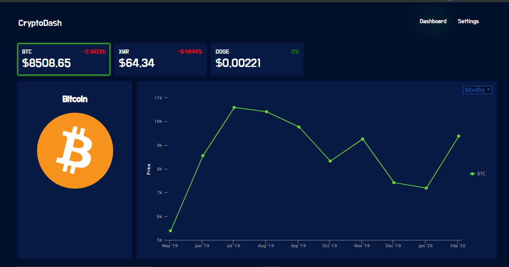

# CryptoDash

A React app that utilizes the CryptoCompare API to provide users with current and historical prices of their favorite crypto currencies.

## [Try it yourself](https://dry-woodland-13435.herokuapp.com/)



### Insallation

Git clone the repository to your local machine: 

HTTPS:
```
$ git clone https://github.com/SolomanGarcia/cryptodash
```
SSH:
````
$ git clone git@github.com:SolomanGarcia/cryptodash.git
````
Next, cd into the repository you cloned and install the necessary dependencies by running:
````
$ npm install
````

You will then be able to start the app locally by runnning:
````
$ npm start
````

## Built With
* [React.js](https://reactjs.org/) - MVC front-end framework
* [npm](https://www.npmjs.com/) - Dependency management
* [CryptoCompare](https://min-api.cryptocompare.com/) - API
* [Styled-components](https://styled-components.com/) - Styling framework
* [React-highcharts](https://github.com/highcharts/highcharts-react)
* [Moment](https://momentjs.com/)
* [Fuzzy-search](https://www.npmjs.com/package/fuzzy-search)
* [Lodash](https://lodash.com/)

## Authors
See contribution history [here](https://github.com/SolomanGarcia/cryptodash/graphs/contributors)

## Future Updates
At the moment, this app is a minimum viable product. In the future the UI/UX will be improved and the app will be converted to a full-stack app using MongoDB and Express.js.